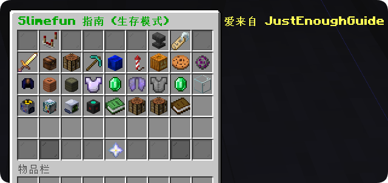
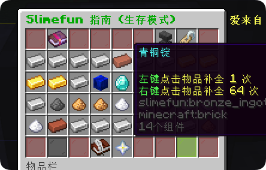
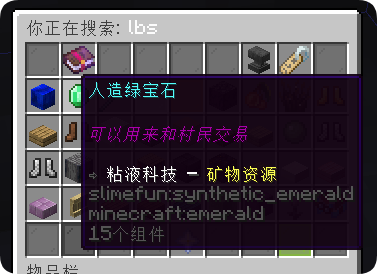
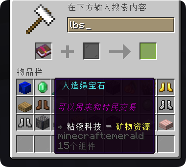
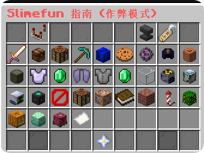
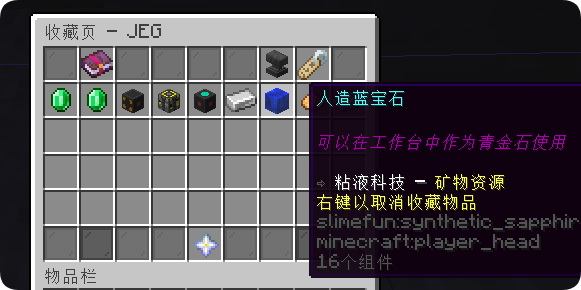
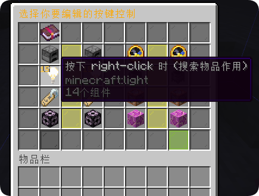

# JustEnoughGuide - 更好的粘液书（Better Slimefun Guide）

 

[下载插件](https://resources.guizhanss.com/plugin/JustEnoughGuide/versions)

JustEnoughGuide（简称 JEG）是一个**粘液科技（Slimefun）附属插件**，它显著改进了原版粘液指南书的功能和体验，让玩家能更直观、更高效地查阅粘液物品配方与信息。

- **运行环境**：Minecraft 1.16+（推荐 1.21.10+），Paper 及其下游服务端
- **必需前置**：Slimefun4、GuizhanLibPlugin
- **可选适配**：SlimefunTranslation、EMCTech、FinalTech / FinalTECH、Logitech 等

## 配方补全

在配方页面直接把材料补全进机器，不用再一趟趟搬运：

- **一键补全**：点击配方页的补全按钮，自动向目标机器填入材料并开始工作
- **递归补全**：中间材料缺失时，自动向下补齐子配方（可在指南设置中开关）
- **从附近容器取材**：补全时优先从身边箱子里抽材料（指南设置中可开关）
- **缺少材料提示**：材料不足时明确告诉你缺什么
- **自动添加补全按钮**：适配机器的配方页自动出现补全入口，可在配置中按方块 / 附属排除

## 拼音搜索

- 支持用**全拼或首字母**搜索中文物品名，比如输入 `nj` 或 `ningjiao` 找到「凝胶」
- **相似字互通**：把容易打错的字放进同一组（如「粘黏」「荧萤」），错别字也能搜到
- **黑名单 / 禁用词**：控制哪些关键词不再出现在搜索结果里

## 实时搜索（RTS）

- 在**铁砧界面**中边输入边搜索，无需输入完整名称
- 搜索结果实时刷新，点击直达物品页
- 可在指南界面中直接发起，配合书签系统快速定位常用物品

## 界面优化

- **全界面自定义布局**：主界面、分类页、配方页、设置页等十余个界面均可通过配置文件调整
- **字符映射排布**：每个格子的功能用字符表示（背景板 B、搜索 S、物品组 G……），改字符位置就能挪动按钮
- **更清晰的导航**：返回、翻页、搜索、收藏等按钮位置一目了然

## 书签系统

- **收藏常用物品**：在物品页一键收藏，随时从收藏列表快速访问
- **持久化存储**：书签数据保存在玩家个人数据中，重进服务器不丢失

## EMC 适配显示

- 支持 **EMC 科技（EMCTech）**、**乱序技艺（FinalTech / FinalTECH）** 等附属的物品 EMC 值在指南中显示
- 各附属的 EMC 显示可在配置中独立开关

## 指南按键绑定

- 玩家可在**指南设置**中自定义各功能按键（如返回、搜索等）的映射
- 自定义后点击原按键位置会**自动重定向**到映射后的功能
- 服务端可一键关闭重定向，强制所有人使用默认按键

## 超大配方显示

- 支持**超大配方**（6x6）的完整展示，不再被 3x3 格子憋死
- 配方页预留超大配方入口位（布局字符 `E`），可自由调整位置

## 自定义物品组排序支持

- 支持创建**自定义物品组**，把散落的物品归拢到一起
- 支持**物品组排序**与**组内层级（tier）排序**，附属组乱七八糟的顺序随你整理
- 可隐藏不想展示的物品组

## 附属翻译

- 内置**数百个粘液附属**的中文显示名映射，搜索中附属名不再中英混杂
- 缺的翻译可在配置中自行补一行

## 常用指令

| 指令 | 说明 |
|------|------|
| `/jeg help` | 查看帮助 |
| `/jeg timings` | 查看粘液机器性能分析（上一 tick 耗时、评分、最耗时机器 / 区块 / 插件榜） |

## 配置

插件行为基本都可以在 `config.yml` 里调整，**每个配置项都附有一句话说明**：告诉你它是干什么的、想实现什么效果应该怎么改。首次启动服务器后会在 `plugins/JustEnoughGuide/config.yml` 生成配置文件，改完重启（或 `/jeg reload`）生效。

## 使用方法

1. 将插件放入服务器 `plugins` 文件夹
2. 启动服务器以生成配置文件
3. 根据需要修改配置文件（每项都有注释说明）
4. 重启服务器使配置生效
5. 玩家使用 Slimefun 指南书时将自动应用所有改进

## 贡献

欢迎提交 Issue 和 Pull Request 来帮助改进这个插件，也请先阅读[行为准则](./CODE_OF_CONDUCT.md)。

## 许可证

本项目基于 GPLv3 许可证开源。

如果你觉得这个附属还不错，可以请作者喝一杯奶茶喵~

